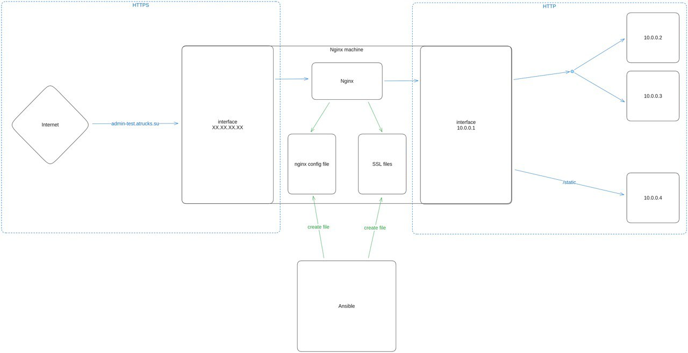

# Ansible должен:
- сгенерировать ssl сертификат для указанного адреса, используя сервис LetsEncrypt
- загрузить файлы сертификата на хост nginx
- загрузить файл конфигурации nginx на хост nginx
- перезагрузить nginx, чтобы настройки применились
# Nginx должен:
- принимать запросы из внешней сети по протоколу https (для этого используется ssl)
- запросы по пути /static перенаправлять на хост 10.0.0.4
- остальные запросы балансировать между хостами 10.0.0.2 и 10.0.0.3

 

# Запуск playbook:

`
ansible-playbook -i inventory site.yml
`
# Этот playbook выполнит следующие шаги:

- Установит Nginx.
- Сконфигурирует Nginx для проксирования запросов и балансировки нагрузки.
- Установит Certbot.
- Получит SSL-сертификаты от Let's Encrypt.
- Настроит автоматическое обновление сертификатов.
- Перезагрузит Nginx для применения изменений.

